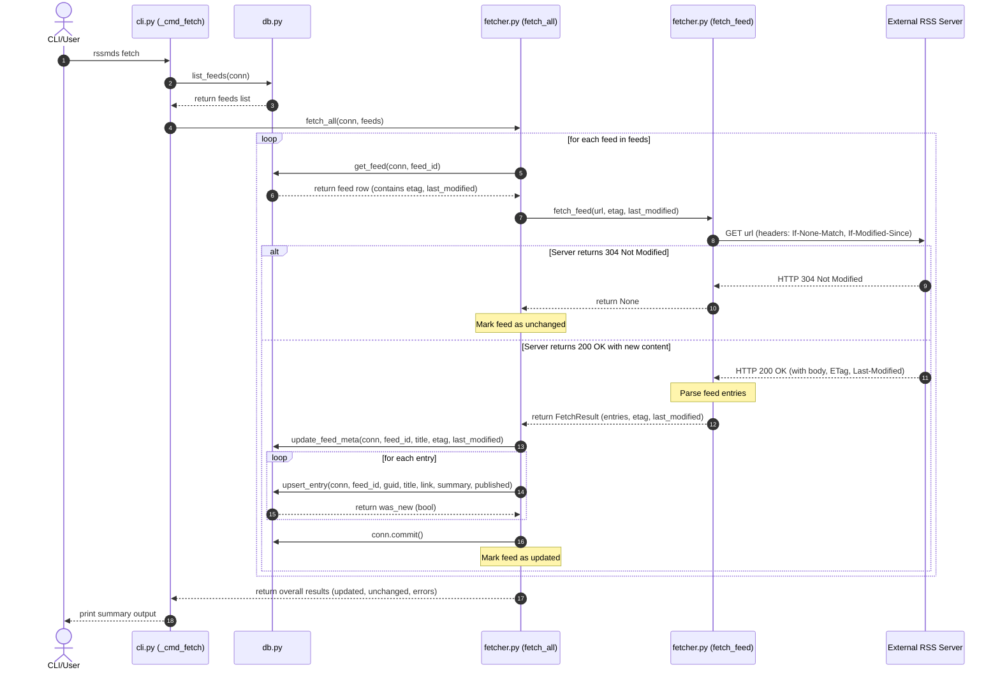

# Lab 9 - Exercise 1 Answers

## 1. Trace of `rssmds add` for an existing URL

When `rssmds add` is called with a URL that already exists in the database, the following trace occurs:

1. **CLI Layer (`rssmds/cli.py`)**:
   - The CLI parser defined in `main()` registers the subcommand `add` with arguments `url` and `--title`.
   - On execution, `main()` parses the arguments, establishes a database connection `conn` via `db.connect()`, and calls `_dispatch(args, conn, config)`.
   - `_dispatch()` dispatches to `_cmd_add(args, conn)`.
   - `_cmd_add()` calls `db.add_feed(conn, args.url, title=args.title)`.

2. **Database Layer (`rssmds/db.py`)**:
   - `add_feed(conn, url, title)` executes the SQL statement:
     ```sql
     INSERT INTO feeds (url, title) VALUES (?, ?)
     ```
   - Since the `feeds` table schema defines the `url` column as `UNIQUE NOT NULL` (enforced during schema initialization in `_ensure_schema`), inserting a duplicate URL raises a `sqlite3.IntegrityError`.
   - The `add_feed` function catches the `sqlite3.IntegrityError` in a `try...except` block and returns `False`.

3. **CLI Handling & Exit**:
   - Back in `_cmd_add()`, because `db.add_feed()` returned `False`, the `ok` variable is `False`.
   - The CLI prints `"Feed already exists: <url>"` to `sys.stderr` and terminates the process with `sys.exit(1)`.

---

## 2. HTTP Caching Mechanism in the Fetcher

To avoid re-downloading unchanged feeds, the fetcher utilizes **HTTP Conditional Requests**:

- **HTTP Headers Used**:
  - **ETag / If-None-Match**: If the database holds a cached `etag` string for the feed, the fetcher sends it in the `If-None-Match` request header.
  - **Last-Modified / If-Modified-Since**: If the database holds a cached `last_modified` string for the feed, the fetcher sends it in the `If-Modified-Since` request header.
- **Server Response**:
  - If the feed hasn't changed on the server, the server returns an HTTP status code `304 Not Modified` with an empty body.
- **Implementation Function**:
  - This is implemented in the `fetch_feed` function in [fetcher.py](file:///c:/Users/jeanl/OneDrive/Desktop/labmds/L9/rssmds/fetcher.py#L15-L46). If the response status is `304`, the function immediately returns `None` to indicate no new data.

---

## 3. Feed Discovery Strategies in `discover_feeds`

The `discover_feeds` function in [discovery.py](file:///c:/Users/jeanl/OneDrive/Desktop/labmds/L9/rssmds/discovery.py#L29-L50) attempts 5 strategies sequentially to locate feeds:

1. **Direct Content-Type Check**:
   - **When it kicks in**: Immediately upon fetching the URL.
   - **Details**: It checks if the `Content-Type` header matches recognized feed types (e.g. `application/rss+xml`, `application/atom+xml`). If so, it treats the URL as a direct feed.
2. **Direct XML Signature Check**:
   - **When it kicks in**: If the Content-Type header doesn't match but the response body starts with an XML declaration and tags like `<rss` or `<feed`.
   - **Details**: It treats the URL as a direct feed.
3. **HTML `<link>` Tag Parsing (`_extract_link_tags`)**:
   - **When it kicks in**: If the URL points to an HTML page.
   - **Details**: It parses the HTML to search for `<link rel="alternate">` elements with types matching recognized feed MIME types. This is the standard way blogs advertise feeds.
4. **Common Paths Probing (`_probe_common_paths`)**:
   - **When it kicks in**: If no links are found in standard `<link>` tags.
   - **Details**: It probes standard directories under the host root (e.g., `/feed`, `/rss.xml`, `/atom.xml`) using HTTP `HEAD` requests. If a request returns `200 OK` with a feed content type, it collects the URL.
5. **HTML Anchor Links Parsing (`_extract_anchor_links`)**:
   - **When it kicks in**: If all else fails.
   - **Details**: It scans `<a>` anchor tags in the page body, looking for links or texts containing keywords like "rss", "feed", "atom" and ending in `.xml`, `.rss` or `.atom`.

---

## 4. Mermaid Sequence Diagram for `rssmds fetch` Flow


